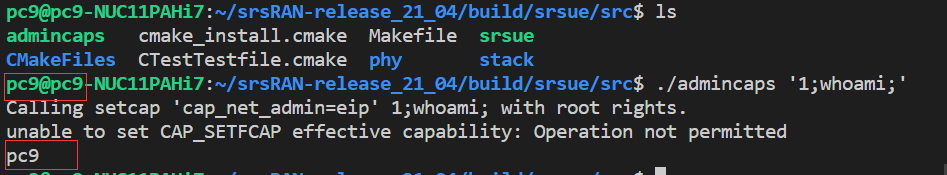
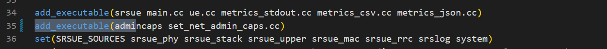

#### Description

I found a command injection vulnerability in srsue/src/set_net_admin_caps.cc and I build a local environment to test it.

The problem code is here.

```cpp
int main(int argc, char* argv[])
{
  if (argc != 2) {
    std::cout << "Please call with the binary to provide net admin capabilities to as a parameter." << std::endl;
    std::cout << "E.g. ./set_net_admin_caps myprogCalling " << std::endl;
    return -1;
  }

  std::string command("setcap 'cap_net_admin=eip' ");
  command += argv[1];

  std::cout << "Calling " << command << " with root rights." << std::endl;
  setuid(0);
  system(command.c_str());

  return 0;
}
```

Users can control the parameter "argv[1]" without any filter,and execute any commands.For example,you can execute ``` ./admincaps '1;whoami;' ```.



#### Proof

All version of srsRAN has the same question.

You need to add ``` add_executable(admincaps set_net_admin_caps.cc) ``` in srsue/src/CMakeLists.txt.



Then you can build and install srsue.

```bash
mkdir build
cd build
cmake ..
sudo make
sudo make install
```

After install srsue, you can run ``` ./admincaps '1;whoami;' ``` in build/srsue/src.


#### Solution

You can fix it by add some filter rules on the parameter "argv[1]",such as ban the illegal characters.
